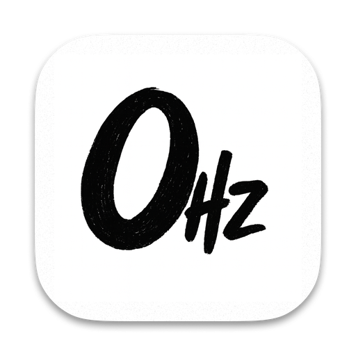

  
  <h1>ZeroHz</h1>
  
<strong>Focus. Relax. Sleep.</strong>

  
ZeroHz is a minimalist white noise application designed to help you create your perfect soundscape.

  
  

 

## ✨ Features

- **🌊 High-Quality Nature Sounds**: Immerse yourself in Rain, Wind, Waves, Forest, Stream, Fire, Flight, Train, and Night sounds.
- **🎛️ Custom Mixing**: Adjust the volume of each sound individually to create your unique atmosphere.
- **🔄 Seamless Looping**: Enjoy uninterrupted, gapless playback for deep focus or sleep.
- **🤏 Compact Mode**: A tiny, non-intrusive mini-player that stays out of your way while you work.
- **🌙 Dark Theme**: Designed to be easy on the eyes, perfect for night-time usage.

## 📥 Download

ZeroHz is available for **macOS** and **Windows**.

1. Go to the [Releases Page](https://github.com/Aweeesome-lab/ZeroHz/releases/latest).
2. Download the installer for your operating system:
   - **macOS**: `.dmg` file
   - **Windows**: `.exe` file (coming soon)

## 💡 How to Use

1. **Select Sounds**: Click on the icons to toggle sounds on/off.
2. **Mix**: Hover over an active sound to reveal the volume slider and adjust the balance.
3. **Compact Mode**: Click the minimize icon to switch to the floating mini-player.
4. **Timer**: The compact mode shows a simple timer to track your session.

---

  
© 2025 ZeroHz. All rights reserved.

